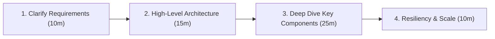
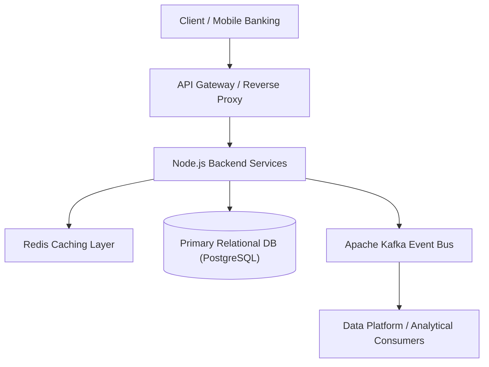

# Khung Đối Thoại Thiết Kế Hệ Thống Phân Tán (ANZ System Design Framework)

> **Thời lượng Stage 2:** 60 phút đối thoại kỹ thuật hai chiều với Kỹ sư ANZ.  
> **Trọng tâm đánh giá:** Khả năng phân tích yêu cầu kinh doanh ngân hàng, thiết kế kiến trúc phân tán có độ sẵn sàng cao (High Availability), đảm bảo tính toàn vẹn dữ liệu (Data Consistency), và giao tiếp tiếng Anh tự tin.

---

## 🧭 Quy trình 4 bước chuẩn mực trong 60 phút

---

## Bước 1: Clarify Scope & Requirements (10 phút)

### Functional Requirements (Yêu cầu chức năng)
- Hệ thống cần phục vụ những nghiệp vụ ngân hàng cốt lõi nào?
- Kịch bản đọc (Read) vs Kịch bản ghi (Write): Hệ thống thiên về đọc nhiều (Read-heavy) hay ghi nhiều (Write-heavy)?

### Non-Functional Requirements (Yêu cầu phi chức năng)
- **Scale (Quy mô):** DAU (Daily Active Users), RPS (Requests Per Second) trung bình và đỉnh (Peak RPS).
- **Latency (Độ trễ):** P95 / P99 dưới bao nhiêu ms (ví dụ: < 100ms cho các API giao dịch).
- **Consistency (Tính nhất quán):** Yêu cầu *Strong Consistency* (CSDL số dư tài khoản) hay chấp nhận *Eventual Consistency* (báo cáo phân tích dữ liệu)?
- **Availability (Độ sẵn sàng):** 99.99% (Four Nines - cho phép downtime < 52 phút/năm).

> **Mẫu đối thoại tiếng Anh:**  
> *"Before proposing the architecture, I'd like to establish the core requirements and scale:*  
> *1. Are we prioritizing strong consistency over eventual consistency for financial transactions?*  
> *2. What is the expected read-to-write ratio and peak transactions per second (TPS)?"*

---

## Bước 2: High-Level Architecture (15 phút)

Thiết kế sơ đồ khối các tầng (Tier-based Architecture):

### Thành phần cơ bản:
1. **API Gateway:** Rate limiting, Authentication, SSL Termination, Load Balancing.
2. **Node.js Application Services:** Stateless microservices xử lý business logic.
3. **Caching Layer (Redis):** Giảm tải cho DB với các truy vấn đọc thường xuyên.
4. **Primary Database (PostgreSQL/Oracle):** Đảm bảo ACID và tính toàn vẹn số dư tài khoản.
5. **Message Queue / Event Streaming (Kafka):** Xương sống luồng sự kiện truyền dữ liệu bất đồng bộ.

---

## Bước 3: Deep Dive Topics (25 phút - Trọng điểm câu hỏi ANZ)

### 1. Tính toàn vẹn thanh toán: Idempotency Key
- **Pain Point:** Người dùng bấm thanh toán 2 lần hoặc client bị timeout mạng rồi tự động retry $\rightarrow$ nguy cơ bị trừ tiền 2 lần.
- **Giải pháp:**
  - Client gửi kèm `Idempotency-Key` (UUID) trong header.
  - Server kiểm tra trạng thái key trong Redis/DB:
    - Nếu key chưa tồn tại: Thực hiện ghi nhận trạng thái `PROCESSING` với TTL 5-10 phút.
    - Nếu key đang `PROCESSING`: Trả về HTTP 409 Conflict hoặc chờ.
    - Nếu key đã `COMPLETED`: Trả về ngay kết quả đã lưu trước đó mà không trừ tiền lần thứ hai.

### 2. Bộ đệm Redis trong môi trường Ngân hàng
- **Chiến lược:** Cache-Aside (Lazy Loading) cho tài khoản và hạn mức:
  - Ứng dụng đọc Redis trước; nếu Cache Miss $\rightarrow$ đọc DB $\rightarrow$ ghi vào Redis kèm TTL.
- **Xử lý sự cố Cache Stampede / Avalanche:**
  - Hiện tượng: Hàng nghìn bản ghi cache cùng hết hạn tại một thời điểm $\rightarrow$ lưu lượng đè sập CSDL.
  - Khắc phục: Áp dụng **TTL Jitter** (TTL cơ bản + khoảng thời gian ngẫu nhiên: `TTL = 3600 + Math.floor(Math.random() * 300)`).
- **Xử lý Cache Penetration (Truy vấn ID rác không tồn tại):**
  - Khắc phục: Dùng **Bloom Filter** kiểm tra nhanh trước, hoặc lưu giá trị `null` vào Redis với TTL ngắn (1-2 phút).
- **Khóa phân tán (Distributed Lock):**
  - Dùng lệnh nguyên tử `SET resource_lock <uuid> NX EX 5` để đảm bảo tại một thời điểm chỉ có duy nhất 1 tiến trình xử lý trừ số dư của khách hàng.

### 3. Hàng đợi sự kiện Apache Kafka (Data Platform Backbone)
- **Lựa chọn Partition Key:**
  - Bắt buộc dùng `customer_account_id` làm Partition Key để đảm bảo toàn bộ giao dịch của một tài khoản luôn rơi vào cùng 1 Partition $\rightarrow$ bảo toàn thứ tự thời gian nghiêm ngặt.
- **Consumer Group & Rebalance:**
  - Tinh chỉnh `max.poll.interval.ms` phù hợp với thời gian xử lý lô của Node.js worker để tránh bị Consumer Group coi là đã chết và kích hoạt Rebalance không mong muốn.
- **Transactional Outbox Pattern (Chống thất thoát dữ liệu giữa DB và Kafka):**
  - Bài toán: Nếu ghi DB thành công nhưng publish Kafka thất bại (network failure) $\rightarrow$ mất dữ liệu phân tích.
  - Giải pháp: Ghi cả dữ liệu nghiệp vụ và sự kiện vào bảng `outbox_events` trong cùng một Database Transaction cục bộ (ACID). Sau đó dùng **Debezium CDC (Change Data Capture)** đọc write-ahead log (WAL) của CSDL để phát tán sự kiện lên Kafka một cách an toàn 100%.

---

## Bước 4: Resiliency & Scale (10 phút)

- **Backpressure trong Node.js:** Sử dụng Node.js Streams có cơ chế kiểm soát áp lực ngược để xử lý dữ liệu báo cáo dung lượng lớn mà không gây tràn heap bộ nhớ (`heap out of memory`).
- **Circuit Breaker Pattern:** Khi một downstream service (như cổng thanh toán liên ngân hàng) bị treo, mở mạch (Open Circuit) ngay lập tức để tránh làm cạn kiệt connection pool của Node.js server.
- **Database Read Replicas:** Tách luồng Read/Write qua Master-Slave để tối ưu hiệu năng CSDL.

