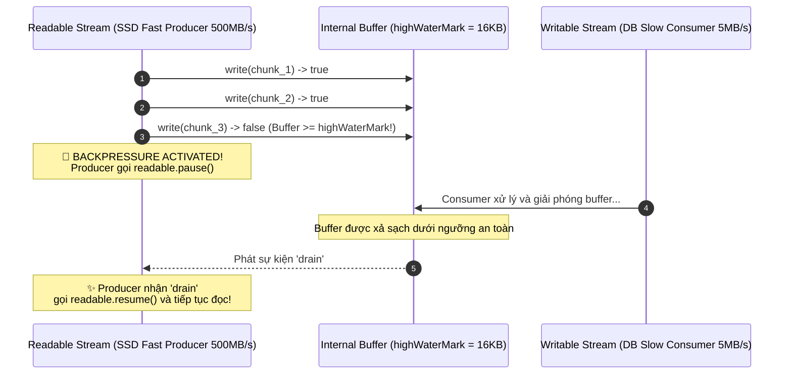

# 📝 Hướng Dẫn Kiến Trúc: Node.js Streams & Backpressure Architecture (Week 2 Day 5)

> **Mục tiêu phỏng vấn ANZ:** Làm chủ kiến trúc xử lý luồng dữ liệu (Streams) trong Node.js, giải thích cặn kẽ cơ chế điều tiết áp suất ngược (**Backpressure Handshake**), phân tích nguy cơ sự cố sập Pod Kubernetes do tràn bộ nhớ (OOMKilled - Exit Code 137), và tự tin thuyết trình bằng tiếng Anh chuẩn 6 bước vòng phỏng vấn System Design.

---

## 🧭 1. Tóm Tắt Tình Huống Kỹ Thuật (The System Scenario)

* **Bối cảnh ANZ Data Platform:**
  - Mỗi đêm, hệ thống Quyết toán giao dịch liên ngân hàng (EOD Settlement Batch) tiếp nhận các tệp sao kê tài chính (SWIFT MT940 / CAMT.053 / Transaction Logs) có dung lượng từ **1GB đến 10GB** chứa hàng triệu bản ghi giao dịch thẻ tín dụng.
  - Dữ liệu cần được: Đọc từ Object Storage (AWS S3 / SFTP) $\rightarrow$ Che mờ thông tin thẻ theo chuẩn PCI-DSS $\rightarrow$ Ghi vào CSDL PostgreSQL / Kafka Topic.
* **Cái bẫy chết người của cách tiếp cận ngây thơ (`fs.readFile()`):**
  - Khi gọi `fs.readFile(filePath)`, Node.js sẽ cố gắng nạp **toàn bộ 2GB nội dung vào V8 Heap Memory** cùng một lúc.
  - V8 Engine mặc định có giới hạn bộ nhớ Heap (~1.4GB trên máy 64-bit).
  - Kết quả: Tiến trình Node.js crash ngay lập tức với lỗi:
    `FATAL ERROR: Ineffective mark-compacts near heap limit Allocation failed - JavaScript heap out of memory`
  - Nếu triển khai trên Kubernetes (K8s), container vượt quá `resources.limits.memory` sẽ bị Linux Kernel OOM Killer tiêu diệt tức thì:
    `Exit Code: 137 (OOMKilled)`.

---

## 🌊 2. Kiến Trúc Luồng (Streams Architecture) & 4 Loại Stream Cốt Lõi

Node.js giải quyết bài toán trên bằng cách **chia nhỏ dữ liệu thành từng mảnh (Chunks)** và luân chuyển qua đường ống dẫn:

```text
 ┌──────────────────────┐         ┌──────────────────────┐         ┌──────────────────────┐
 │   READABLE STREAM    │         │   TRANSFORM STREAM   │         │   WRITABLE STREAM    │
 │ (Transaction Source) │ ──────> │ (PCI-DSS Card Mask)  │ ──────> │ (Slow DB/Kafka Sink) │
 └──────────────────────┘  Chunk  └──────────────────────┘  Chunk  └──────────────────────┘
      (Disk / S3)                                                     (PostgreSQL / Kafka)
```

| Loại Stream | Đặc điểm | Ví dụ thực tế tại ANZ |
|---|---|---|
| **Readable** | Nguồn phát sinh dữ liệu (chỉ đọc). Phát sự kiện `'data'`, kết thúc bằng `'end'`. | `fs.createReadStream()`, `http.IncomingMessage` |
| **Writable** | Điểm tiếp nhận dữ liệu (chỉ ghi). Nhận `write()`, kết thúc bằng `'finish'`. | `fs.createWriteStream()`, `http.ServerResponse`, DB Batch Insert |
| **Transform** | Luồng biến đổi hai chiều: nhận input, xử lý và đẩy ra output. | Gzip nén dữ liệu, Masking thông tin thẻ tín dụng PCI-DSS |
| **Duplex** | Luồng vừa đọc vừa ghi độc lập. | `net.Socket` (TCP connection) |

---

## ⚠️ 3. Vấn Đề Áp Suất Ngược (The Backpressure Problem)

Một câu hỏi phỏng vấn phân loại Senior tại ANZ Bank:
> *"Điều gì sẽ xảy ra nếu Producer đọc file từ SSD cực nhanh (500MB/s) trong khi Consumer ghi vào Database chỉ đạt 5MB/s? Streams có tự động giải quyết được vấn đề này không?"*

### 💡 Cơ chế Backpressure Handshake:
Nếu không có điều tiết, dữ liệu đọc nhanh sẽ ứ đọng lại trong bộ nhớ đệm (internal buffer), khiến RAM tiếp tục phình to dẫn đến OOM.



1. **Ngưỡng an toàn (`highWaterMark`):** Mặc định là 64KB (hoặc 16 đối với objectMode).
2. Khi `writable.write(chunk)` trả về `false`, Writable đang cảnh báo: *"Tôi đã đầy bộ đệm, hãy ngừng gửi thêm!"*
3. Readable Stream lập tức gọi `readable.pause()`.
4. Khi Consumer xử lý xong và bộ đệm hạ xuống mức an toàn, Writable Stream phát sự kiện `'drain'`.
5. Readable Stream lắng nghe sự kiện `'drain'` và gọi `readable.resume()` để tiếp tục phát dữ liệu.

---

## 🛡️ 4. Tại sao luôn dùng `stream.pipeline()` thay vì `readable.pipe()`?

* **Lỗ hổng của `.pipe()` truyền thống:**
  - Nếu luồng ở giữa (Transform) hoặc luồng đích (Writable) phát sinh lỗi (error), `.pipe()` **KHÔNG tự động hủy (destroy) các luồng còn lại**.
  - Kết quả: File descriptor bị treo, rò rỉ socket và rò rỉ bộ nhớ (Memory Leak).
* **Ưu thế vượt trội của `pipeline()`:**
  - Tự động đóng và dọn dẹp sạch sẽ tất cả các stream trong chuỗi khi có bất kỳ stream nào gặp sự cố (`stream.destroyed === true`).
  - Hỗ trợ cú pháp `async/await` hiện đại qua `promisify(pipeline)`.

---

## 🎙️ 5. Kịch Bản Tiếng Anh 6 Bước (ANZ System Design Script)

### Step 1: Clarify (Làm rõ yêu cầu hệ thống)
> *"Before discussing the implementation, I'd like to clarify a few system constraints. What is the expected file size for the batch settlement? Let's say between 1GB and 10GB. What are the memory limits on our Kubernetes pods? Assuming a strict 512MB RAM limit per pod. And what is our downstream throughput capacity when persisting into the database? Understanding this producer-consumer speed gap is critical for designing our data pipeline."*

### Step 2: Naive Approach (Chỉ ra điểm sập của cách truyền thống)
> *"A naive approach would use `fs.readFile()` to buffer the entire file into memory before processing. However, loading a 2GB file will instantly exceed the default V8 heap limit of 1.4GB, causing a fatal 'JavaScript heap out of memory' crash or triggering a Kubernetes OOMKilled exit code 137. This approach does not scale."*

### Step 3: Optimize (Đề xuất giải pháp kiến trúc Streams & Backpressure)
> *"To achieve enterprise-grade stability with constant memory consumption, we should implement a Node.js Streams pipeline. By chunking data into manageable segments using a Readable stream, piping through a Transform stream for PCI-DSS data masking, and writing to a Writable batch consumer, we keep memory usage flat. Crucially, we enforce backpressure handling so that when downstream writes are slow, the upstream reader automatically pauses instead of buffering unbounded data in RAM."*

### Step 4: Think Out Loud (Thuyết minh cơ chế điều tiết)
> *"Let's trace the backpressure handshake. The Writable stream defines a `highWaterMark`, typically 16KB. When `writable.write()` returns `false`, it signals that the internal buffer is full. The producer immediately pauses. Once the database consumer flushes the buffer below the threshold, the writable stream emits the `'drain'` event. Upon receiving `'drain'`, the readable stream calls `resume()` and continues streaming."*

### Step 5: Dry Run & Verification (Kiểm chứng bộ nhớ thực tế)
> *"In our benchmark test, we simulated streaming 50,000 transaction records through this pipeline. We measured the V8 heap usage using `process.memoryUsage().heapUsed`. Despite processing tens of thousands of complex objects, the heap delta remained strictly under 5MB. Furthermore, by wrapping the execution in `stream.pipeline()`, any runtime exception cleanly destroys all underlying streams, preventing socket or file descriptor leaks."*

### Step 6: Conclusion (Tổng kết hiệu năng & Độ bền)
> *"In conclusion, this architecture delivers O(n) streaming time with strictly O(1) constant memory overhead. RAM consumption remains capped below 30MB regardless of whether the incoming settlement file is 100MB or 100GB, fully protecting our banking microservices from OOM outages."*

---

## 🖥️ 6. Trực Quan Hóa Tương Tác (Generative UI)

Để quan sát trực tiếp cơ chế điều tiết lưu lượng Backpressure, sự kiện `'drain'` và đồng hồ đo RAM:
- Mở bộ mô phỏng trực tiếp tại: **[`docs/visualizers/w2-05-streams-backpressure.html`](file:///home/samnguyen/projects/training-anz/docs/visualizers/w2-05-streams-backpressure.html)**.
