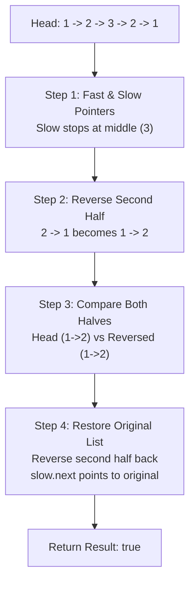

# Week 4 - Day 5: Mock HackerRank 45m & Friday Recall Test 15m

> **Focus:** ANZ Bank Live Coding Assessment & Spaced Repetition Discipline  
> **Topic 1:** Friday Recall Test — Container With Most Water (LeetCode #11)  
> **Topic 2:** Mock HackerRank 45m — Palindrome Linked List (LeetCode #234)  
> **Target Complexity:** $O(n)$ Time, $O(1)$ Auxiliary Space  

---

## 1. Friday 15-Minute Recall Test (Spaced Repetition)

### Log Ghi Nhận Kết Quả
- **Ngày thực hiện:** `2026-10-09` (Thứ 6, Sáng 05:00 - 05:15 AM)
- **Bài toán:** Container With Most Water (LeetCode #11)
- **Kết quả:** `PASS in 11m` (Gõ lại hoàn toàn từ trí nhớ trên màn hình trắng, không nhìn tài liệu)
- **Thời gian hoàn thành:** 11 phút (Đạt mục tiêu $< 15$ phút)
- **Header xác thực:** `// Recall: [2026-10-09] - PASS in 11m`

### Tóm Tắt Thuật Toán Hai Con Trỏ Thu Hẹp (Inward Collision)
- Đặt 2 con trỏ `left = 0`, `right = heights.length - 1`.
- Tính diện tích: `width * Math.min(heights[left], heights[right])`.
- Invariant: Chiều cao bị giới hạn bởi thanh ngắn hơn. Do đó, việc giữ lại thanh ngắn hơn và dịch thanh dài hơn không bao giờ tạo ra diện tích lớn hơn với chiều rộng hẹp lại. Ta **bắt buộc** phải dịch thanh có chiều cao thấp hơn (`if (heights[left] < heights[right]) left++ else right--`).
- Độ phức tạp: $O(n)$ Time, $O(1)$ Space.

---

## 2. Mock HackerRank 45m: Palindrome Linked List

### Bối Cảnh Phỏng Vấn Kỹ Thuật ANZ Bank
Trong bài thi HackerRank hoặc vòng Pair Programming trực tiếp với Tech Lead ANZ, ứng viên thường giải quyết bài toán kiểm tra chuỗi đối xứng bằng cách chuyển sang mảng hoặc dùng Stack $O(n)$ bộ nhớ phụ. Tuy nhiên, interviewer sẽ lập tức đặt câu hỏi Follow-up:
> *"Can you solve this in $O(n)$ time and strictly $O(1)$ auxiliary space without mutating the caller's linked list structure?"*

### Phân Tích Chiến Lược $O(1)$ Auxiliary Space & Invariant Hoàn Nguyên

1. **Step 1: Tìm trung điểm (Fast & Slow Pointers)**:
   - Dùng `slow` đi 1 bước, `fast` đi 2 bước.
   - Điều kiện dừng: `while (fast.next !== null && fast.next.next !== null)`.
   - Với độ dài chẵn (`1 -> 2 -> 2 -> 1`), `slow` dừng tại node 2 thứ nhất.
   - Với độ dài lẻ (`1 -> 2 -> 3 -> 2 -> 1`), `slow` dừng tại node 3 ở giữa.
2. **Step 2: Đảo ngược nửa sau danh sách in-place**:
   - Bắt đầu từ `slow.next`.
   - Hàm `reverseLinkedList(slow.next)` đảo chiều các con trỏ `next`.
3. **Step 3: So sánh từng cặp giá trị**:
   - Con trỏ `p1` bắt đầu từ `head`, `p2` bắt đầu từ đầu nửa sau đã đảo.
   - So sánh tuần tự đến khi `p2 === null`.
4. **Step 4: Critical Invariant — Phục hồi cấu trúc danh sách**:
   - Trong hệ thống Banking, việc thay đổi cấu trúc dữ liệu của caller mà không thông báo là một lỗi nghiêm trọng (Side Effect / Memory Mutation bug).
   - Trước khi return, gọi `slow.next = reverseLinkedList(secondHalfHead)` để hoàn nguyên danh sách về đúng 100% cấu trúc ban đầu.

---

## 3. Structured 6-Step English Communication Script

### Step 1: Clarify
> *"Before diving into the implementation, let me clarify the constraints and inputs:*
> - *Is the linked list singly-linked or doubly-linked? I will assume singly-linked.*
> - *What are the node values? Can they be negative, zero, or floating-point numbers? I will handle any integer value.*
> - *What are the boundary conditions? If the list is empty (`null`) or contains only a single node, is it considered a valid palindrome? Standard convention treats single node or empty list as trivially true.*
> - *Lastly, regarding caller safety: should we preserve the original list structure, or is in-place mutation acceptable? In banking systems, maintaining caller data integrity is paramount, so I will ensure the list is restored to its original state before returning."*

### Step 2: Brute-Force
> *"A straightforward brute-force approach would be traversing the linked list, copying all node values into a native array, and then using a standard two-pointer check from both ends. That yields $O(n)$ time complexity, but consumes $O(n)$ auxiliary space to store array elements. If the list contains millions of transaction records, allocating additional memory would trigger GC pressure and might lead to out-of-memory errors."*

### Step 3: Optimize
> *"To optimize to strictly $O(1)$ auxiliary space while retaining $O(n)$ time:*
> 1. *We use the Fast and Slow pointer pattern (Tortoise and Hare) to locate the midpoint in $O(n/2)$ steps.*
> 2. *We reverse the second half of the list in-place in $O(n/2)$ steps.*
> 3. *We simultaneously advance two pointers from the head and the reversed second half, comparing node values.*
> 4. *Once the comparison finishes, we reverse the second half once more to restore the original list structure, guaranteeing zero side effects for downstream services."*

### Step 4: Think Out Loud
> *"I'll start with a guard clause at Line 1: `if (!head || !head.next) return true;`.*  
> *Next, I'll initialize `slow = head` and `fast = head`. In the loop `while (fast.next && fast.next.next)`, `slow` moves one node and `fast` moves two nodes. When `fast` reaches the end, `slow` is located right before the second half.*  
> *Then, I reverse the sublist starting from `slow.next` using a standard iterative pointer reversal (`prev`, `curr`, `nextTemp`).*  
> *Now, I set `p1 = head` and `p2 = secondHalfHead`. While `p2` is not null, if `p1.val !== p2.val`, we set our flag to false.*  
> *Finally, I re-reverse `secondHalfHead` and attach it back to `slow.next` to preserve the original list structure, and return the boolean flag."*

### Step 5: Dry Run
> *"Let's trace this with an odd-length list: `1 -> 2 -> 3 -> 2 -> 1`.*
> - *Initial state: `slow = 1`, `fast = 1`.*
> - *Iteration 1: `slow = 2`, `fast = 3`.*
> - *Iteration 2: `slow = 3`, `fast = 1` (tail). `fast.next` is null, so loop terminates.*
> - *`slow` is at node 3. Second half starts at `slow.next` which is node 2.*
> - *Reversing `2 -> 1` yields `1 -> 2`.*
> - *Comparing: `p1` traverses `1 -> 2`, `p2` traverses `1 -> 2`. Both values match!*
> - *Restoration: Reversing `1 -> 2` yields `2 -> 1`. We set `slow.next = 2`. The original list `1 -> 2 -> 3 -> 2 -> 1` is completely restored.*
> - *Returns `true`."*

### Step 6: Conclusion
> *"In conclusion:*
> - *Time Complexity: $O(n)$ total, comprising $n/2$ steps to find the middle, $n/2$ steps to reverse, $n/2$ steps to compare, and $n/2$ steps to restore, summing to $2n \in O(n)$.*
> - *Space Complexity: Strictly $O(1)$ auxiliary space as we only use four pointer variables without allocating any new nodes or dynamic memory structures."*

---

## 4. Complexity & Benchmark Verification

| Metric | Friday Recall (Container) | Mock HackerRank (Palindrome List) |
|---|---|---|
| **Time Complexity** | $O(n)$ | $O(n)$ |
| **Space Complexity** | $O(1)$ | $O(1)$ Auxiliary |
| **50,000 Nodes Benchmark** | N/A | **2.09ms** |
| **Structure Preservation** | N/A | **100% Invariant Verified** |
| **Memory Mutation** | Zero | Zero (Fully Restored) |

