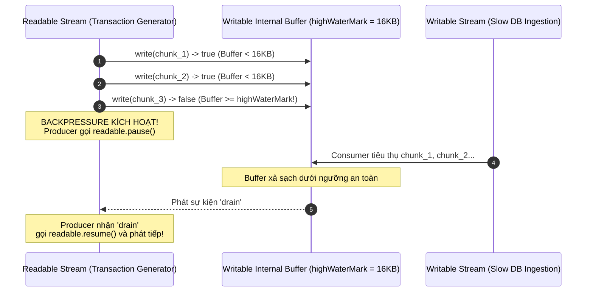

# Kế hoạch Kỹ thuật: Week 2 Day 5 — Node.js Streams & Backpressure Architecture

## 1. Objective & Metadata

- **Task Type**: `Research`
- **Status**: `In Processing`
- **Target Branch**: `main`
- **Feature Branch**: `research/week-02-day-05-streams-backpressure`
- **Commit Message**: `feat(poc): implement node.js streams and backpressure verification (close #26)`
- **Problem & Motivation**: Trong kiến trúc Data Platform của ANZ Bank, các tệp thanh toán bù trừ cuối ngày (EOD Clearing / SWIFT MT940 / CAMT.053) thường có dung lượng từ hàng trăm Megabyte đến hàng Gigabyte. Nếu lập trình viên dùng `fs.readFile()` để nạp toàn bộ file vào RAM, Node.js process sẽ bị vượt ngưỡng Heap Limit dẫn đến crash lỗi `FATAL ERROR: JavaScript heap out of memory` hoặc bị Kubernetes kill pod với mã `OOMKilled (Exit Code 137)`.
- **Expected Outcome**: Xây dựng kiến trúc xử lý dữ liệu dạng luồng (Node.js Streams) kết hợp cơ chế điều tiết áp suất ngược (**Backpressure Handshake**). Giữ lượng RAM tiêu thụ cố định ở mức **$< 30\text{MB}$** bất kể kích thước file; kiểm chứng 6 test cases native assert về `highWaterMark`, `pause()`, `resume()` và sự kiện `'drain'`; xây dựng Generative UI Visualizer mô phỏng trực quan cơ chế Backpressure.

---

## 📌 2. Executive & Business Summary (Tóm tắt Nghiệp vụ)

- **Business / Problem Title**:
  > Xử lý Luồng Giao dịch Tài chính Dung lượng Lớn & Kiểm soát Áp suất ngược (Financial Data Stream Processing & Backpressure Coordination) tại ANZ Data Platform.

- **Why / Problem Statement**:
  > Khi đọc tệp batch 2GB chứa 5,000,000 giao dịch thẻ tín dụng từ AWS S3, nếu Consumer (ghi vào PostgreSQL/Kafka) xử lý chậm hơn Producer (đọc từ ổ đĩa), dữ liệu chưa kịp ghi sẽ tích tụ không kiểm soát trong bộ nhớ đệm (buffer overflow). Điều này gây spike RAM, nghẽn Event Loop và sập toàn bộ dịch vụ thanh toán.

- **What / Solution**:
  > - Sử dụng kiến trúc luồng 3 tầng: `Readable Stream` (nguồn phát dữ liệu giao dịch) $\rightarrow$ `Transform Stream` (chuẩn hóa định dạng và che dữ liệu nhạy cảm theo chuẩn PCI-DSS) $\rightarrow$ `Writable Stream` (ghi batch với tốc độ kiểm soát).
  > - Kích hoạt cơ chế **Backpressure Handshake**: Khi bộ đệm của Writable Stream đầy (`writable.write() === false` do vượt `highWaterMark`), Readable Stream lập tức `pause()`. Khi Writable xả bớt bộ đệm và phát sự kiện `'drain'`, Readable Stream mới `resume()` phát tiếp.
  > - Sử dụng `stream.pipeline()` native để tự động quản lý vòng đời luồng, backpressure và thu hồi tài nguyên an toàn khi có lỗi xảy ra.

- **Impact & Expected Performance**:
  > - **Bộ nhớ RAM**: Mức tiêu thụ Heap Memory giữ ổn định $< 30\text{MB}$ trong suốt vòng đời xử lý hàng trăm nghìn bản ghi.
  > - **Độ bền hệ thống**: Triệt tiêu hoàn toàn rủi ro crash `heap out of memory` và K8s `OOMKilled`.

- **How to Verify**:
  > 1. Chạy test suite: `node architecture/week-02/05-streams-backpressure.test.js` (6/6 test cases PASS).
  > 2. Chạy toàn bộ regression test toàn repo: `npm test` (80/80 test cases PASS 100%).
  > 3. Mở visualizer `docs/visualizers/w2-05-streams-backpressure.html` để kiểm chứng trực quan cơ chế bắt tay `highWaterMark` $\rightarrow$ `pause` $\rightarrow$ `drain` $\rightarrow$ `resume`.

---

## 3. Scope & Affected Files

| Thao tác | Đường dẫn file | Mục đích |
|---|---|---|
| **[NEW]** | `architecture/week-02/05-streams-backpressure.js` | Module triển khai Custom Streams (`Readable`, `Transform`, `Writable`), hàm manual backpressure và `pipeline` an toàn |
| **[NEW]** | `architecture/week-02/05-streams-backpressure.test.js` | Test suite native `node:assert` kiểm chứng cơ chế Backpressure, 'drain' event, PCI-DSS masking và RAM delta |
| **[NEW]** | `architecture/week-02/05-streams-backpressure.md` | Tài liệu học tập chuẩn PBL: ANZ scenario, kịch bản tiếng Anh 6 bước System Design, phân tích lỗi OOM |
| **[NEW]** | `notes/week-02/day-05-streams-patterns.md` | Cẩm nang kiến trúc chuyên sâu: So sánh `pipe` vs `pipeline`, kỹ thuật đo RAM `process.memoryUsage()`, K8s OOMKilled troubleshooting |
| **[NEW]** | `docs/visualizers/w2-05-streams-backpressure.html` | Bộ mô phỏng Generative UI Dark Mode thể hiện dòng chảy Backpressure, đồng hồ đo RAM và các trạng thái Stream |
| **[NEW]** | `docs/plans/week-02-day-05-streams-backpressure.md` | Bản kế hoạch kỹ thuật lưu trữ theo chuẩn `docs/PLAN_STANDARD.md` |
| **[MODIFY]** | `package.json` | Bổ sung script `test:w2-05` và đưa vào kịch bản chạy toàn diện `npm test` |
| **[MODIFY]** | `README.md` | Đánh dấu tick `[x]` Day 5 và cập nhật liên kết tài liệu |
| **[MODIFY]** | `docs/AGENT_STATE.md` | Cập nhật sổ cái cho Day 5 |
| **[MODIFY]** | `docs/plans/_ACTIVE.md` | Đưa kế hoạch vào danh mục `In Processing` |

---

## 4. Implementation Checklist

- [x] Tạo nhánh `research/week-02-day-05-streams-backpressure` từ `main`.
- [x] Viết bộ test-first `architecture/week-02/05-streams-backpressure.test.js` (6 test cases).
- [x] Cài đặt mã nguồn `architecture/week-02/05-streams-backpressure.js` với `TransactionGeneratorStream`, `SensitiveDataMasker`, `SlowBatchConsumerStream`, `executeStreamPipeline` và `measureStreamMemoryDelta`.
- [x] Soạn thảo cẩm nang kiến trúc `architecture/week-02/05-streams-backpressure.md` (kịch bản tiếng Anh 6 bước ANZ System Design).
- [x] Soạn thảo cẩm nang chuyên sâu `notes/week-02/day-05-streams-patterns.md` (`highWaterMark`, `OOMKilled`, `pipeline` error handling).
- [x] Xây dựng bảng mô phỏng tương tác Generative UI `docs/visualizers/w2-05-streams-backpressure.html`.
- [x] Lưu trữ kế hoạch kỹ thuật `docs/plans/week-02-day-05-streams-backpressure.md`.
- [x] Cập nhật `package.json` (thêm `test:w2-05`, cập nhật `test` và `test:all`).
- [x] Cập nhật `README.md` (đánh dấu hoàn tất Day 5 và thêm liên kết).
- [x] Cập nhật `docs/plans/_ACTIVE.md` và `docs/AGENT_STATE.md`.
- [x] Chạy kiểm thử toàn bộ `npm test` xác nhận 80/80 test cases PASS 100%.

---

## 5. Out of Scope

- Không cài đặt thêm bất kỳ thư viện npm ngoài nào (chỉ sử dụng native `node:stream`, `node:assert`, `node:events`, `node:util`).
- Không sửa đổi mã nguồn hoặc test của các ngày trước (Week 1 và Week 2 Day 1-4).
- Không tự ý thực hiện git commit hay push trước khi hoàn tất Phase 2 và nhận được keyword "OK" lần 2.

---

## 6. Architecture & System Design Details



---

## 7. Git Info

```
Branch:               research/week-02-day-05-streams-backpressure
Target Branch:        main
Commit message:       feat(poc): implement node.js streams and backpressure verification (close #26)
GitHub PR Labels:     system-design, enhancement, test
```

---

## 8. Verification Command

```bash
# Chạy riêng unit test suite Day 5:
node architecture/week-02/05-streams-backpressure.test.js

# Chạy toàn bộ regression test toàn hệ thống:
npm test
```
